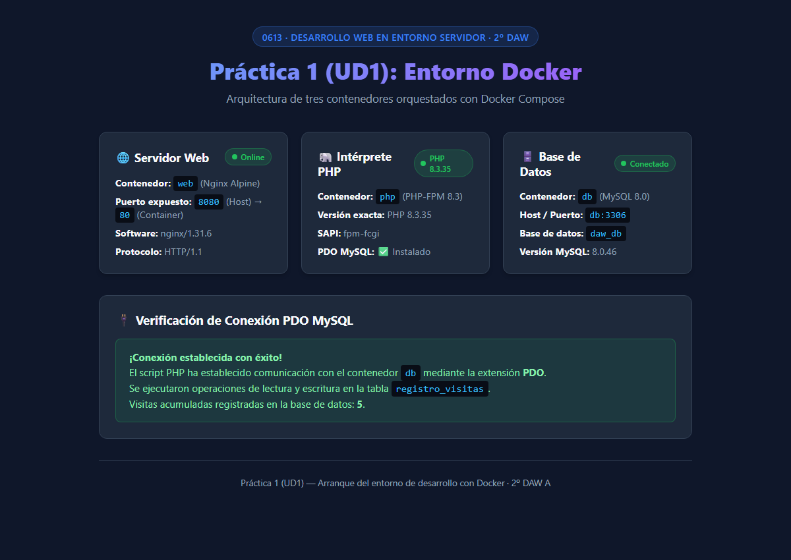

# Práctica 1 (UD1) — Arranque del entorno de desarrollo con Docker

**Módulo:** 0613 · Desarrollo Web en Entorno Servidor (DWES)  
**Curso:** 2º DAW A  
**Tipo:** Trabajo individual  

---

## 📌 Descripción del Proyecto

Este proyecto sustituye la clásica pila monolítica (como XAMPP) por una arquitectura moderna basada en microservicios utilizando **Docker** y **Docker Compose**. Cada servicio se ejecuta de forma aislada e intercomunicada en su propio contenedor dentro de una red virtual compartida:

1. **`web` (Nginx Alpine):** Servidor web expuesto en el puerto host `8080` (redireccionado al puerto `80` interno). Actúa como proxy inverso procesando peticiones estáticas y delegando las peticiones PHP mediante FastCGI al contenedor `php` en el puerto `9000`.
2. **`php` (PHP 8.3 FPM):** Contenedor personalizado mediante un `Dockerfile` que compila e instala las extensiones de conexión a bases de datos (`pdo` y `pdo_mysql`) sobre la imagen base `php:8.3-fpm`.
3. **`db` (MySQL 8.0):** Servidor de base de datos relacional con volumen persistente (`db_data`) y credenciales automáticas para la conexión de la aplicación.

---

## 📁 Estructura del Repositorio

```text
├── .gitignore          # Archivos y patrones excluidos del control de versiones
├── docker-compose.yml  # Definición y orquestación de los 3 servicios y red
├── nginx/
│   └── default.conf    # Configuración de Nginx y paso FastCGI a PHP-FPM
├── php/
│   └── Dockerfile      # Imagen PHP 8.3 con extensiones pdo y pdo_mysql
├── src/
│   └── index.php       # Código PHP de prueba con verificación de conexión PDO
└── README.md           # Documentación e instrucciones de uso
```

---

## 🚀 Cómo Levantarlo

### 1. Requisitos previos
- Tener instalado **Docker** y **Docker Compose** (Docker Desktop en Windows/Mac o docker-ce en Linux).

### 2. Clonar el repositorio
```bash
git clone https://github.com/jga0055/practica1-docker-dwes.git
cd practica1-docker-dwes
```

### 3. Levantar los contenedores
Ejecuta el siguiente comando en la raíz del proyecto para construir la imagen de PHP y arrancar todos los servicios en segundo plano:

```bash
docker compose up -d --build
```

### 4. Acceder a la aplicación
Abre tu navegador web e ingresa a:
👉 [http://localhost:8080](http://localhost:8080)

Visualizarás el panel informativo con el estado de:
- Servidor web Nginx en puerto 8080.
- Versión de PHP 8.3 ejecutándose con PHP-FPM.
- Estado de la conexión PDO con MySQL y contador de visitas persistente.

> **Nota:** La primera vez que se crea el contenedor de MySQL puede tardar unos segundos en inicializar el catálogo de datos. Si al primer segundo muestra aviso de inicialización, simplemente recarga la página.

---

## 🛑 Cómo Detener el Entorno

Para detener y retirar los contenedores preservando los datos:
```bash
docker compose down
```

Si deseas reiniciar o detener eliminando también los volúmenes de datos:
```bash
docker compose down -v
```

---

## 📸 Captura de Pantalla del Resultado

A continuación se muestra la captura del entorno funcionando y la comprobación de la conexión PDO a MySQL en el navegador:


